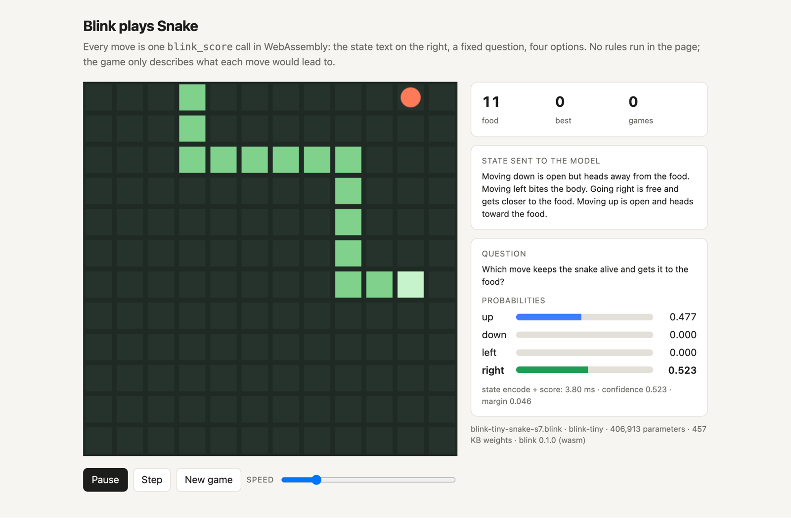
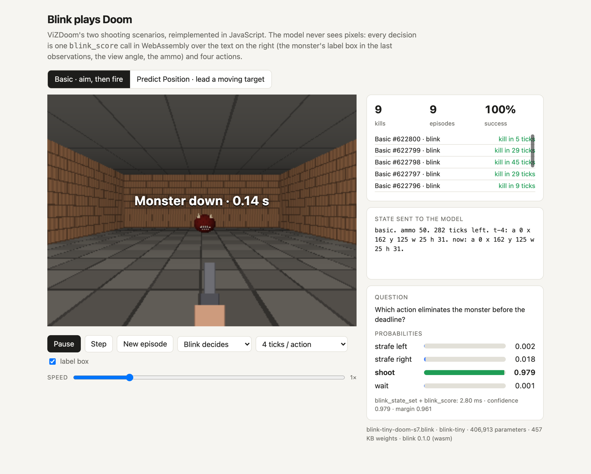
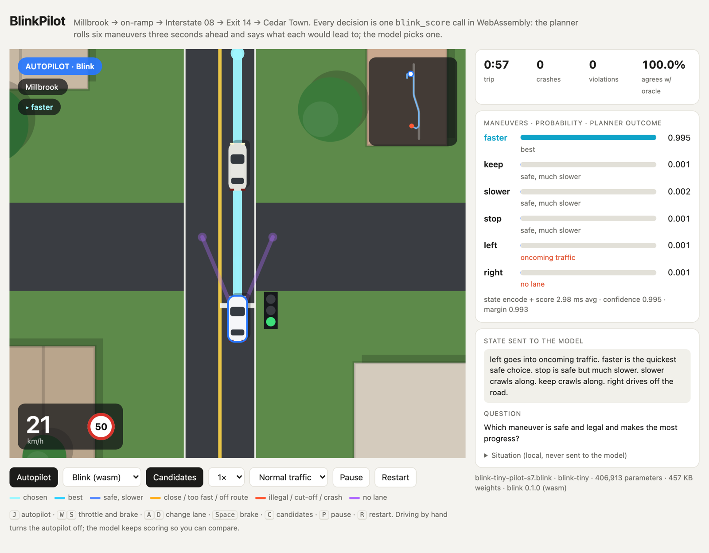

# Blink

**A one-pass typed-decision model with an embeddable C runtime that also
builds to WebAssembly.**

---
TypeSafe released [Jev](https://typesafe.ai/blog/introducing-system-one-models-and-jev),
a closed model in a class they call *System One Models*: fast structured
decisions for software rather than conversation, with calibrated confidence and
no output tokens to pay for. Blink puts that interface behind a C library you
can link into a service, a daemon or a device, or load as WebAssembly in a web
page.

---

Blink answers questions of the form *"given this state and this criterion,
which of these options?"* in a single forward pass. There is no token
generation, no decoding loop, no JSON to parse and nothing to repair: the
output is one probability per option you declared at call time.

The runtime is C99 with no dependencies beyond libc and libm. Weights are
mapped read-only and never copied. Scoring performs **zero allocations** — a
property the test suite checks mechanically, not by inspection.

The same sources build to a 66 KB WebAssembly module that runs unchanged in
browsers and in Node, with no file system and no server
([details](#webassembly)).

```c
#include "blink.h"

blink_model  *model   = blink_model_open_file("blink-tiny.blink", 1, &status);
blink_session *session = blink_session_init(arena, sizeof arena, model, &limits, &status);

blink_state_set(session, ticket, strlen(ticket));           /* encode once  */
blink_menu_set(session, queues, lengths, 4);                /* encode once  */
blink_score(session, "Which team should handle this?", 29,  /* cheap        */
            probabilities, &result);
```

**What it is good for, in one paragraph.** Blink recognises the *form* of a
decision; it does not read text the way a pretrained language model does.
Where the answer is carried by form — which queue a ticket's wording points
at, whether a claim's verb agrees with the state — blink-tiny is near perfect
and well calibrated. Where the answer requires reading — natural language
inference, binding a name to the right sentence — it is at or a little above
chance, and a frozen 4B model is far ahead. Its confidence is calibrated
enough to branch on: answer when it is sure, escalate when it is not.

## Performance

blink-tiny on one core of an Apple M5 Pro: one decision over a 256-byte state,
a question and four options, p50.

| build | fresh decision | same state, new question | decisions/s, state reused |
|---|---:|---:|---:|
| default (C99, NEON) | 406 µs | 54 µs | 18,211 |
| [W8A8](#w8a8-backend-sdot--i8mm) (int8 activations, SDOT) | 221 µs | 33 µs | 29,481 |
| [Accelerate](#accelerate-backend-macos) (macOS) | 172 µs | 32 µs | 31,290 |

A fresh decision encodes the state, the options and the question. Software
usually asks several questions of the same state, and then only the question
is encoded: the cached state is reused exactly, bit for bit. On x86-64 the
AVX2 kernel does the same decision in 760 µs, and 90 µs with the state reused,
on a GitHub-hosted runner.

**Memory. Nothing is allocated while scoring: not per decision, not per
question, not per option.** All the working memory a session needs is one
arena, sized before the session exists and placed wherever you choose, a static
array or a stack buffer included, so Blink runs where `malloc` is unavailable
or not allowed. This is checked, not assumed: `tests/c/check_no_malloc.sh`
fails the build if the scoring code references any allocator.

blink-tiny's weights are 452 KiB of int8, mapped read-only and shared by every
session and every process that opens the same file. The arena is 260 KiB with
the model's default limits and 22 KiB with the smallest. One decision from the
command line peaks at 2.5 MiB of resident memory, the whole process included.
The W8A8 build keeps the no-allocation guarantee; the Accelerate build gives it
up, because the framework allocates inside its matrix products
([details](#memory)).

A larger preset, blink-small (7.9M parameters), is **experimental**: it is
worse than blink-tiny on every corpus measured and about ten times slower to
encode, so its containers are not shipped
([why](docs/RESULTS.md#5-what-does-not-work)).

All the benchmark tables, and a comparison with other systems that expose the
same interface, are in [docs/RESULTS.md](docs/RESULTS.md#comparison-with-other-systems).

---

## Quick start

```bash
git clone https://github.com/sqliteai/blink
cd blink
make                     # C runtime, tools, benchmarks. No Python needed.
make test                # unit tests + the no-allocation check
make bench               # latency and memory as JSON
make install             # blink, libblink, blink.h, blink.pc, man page under /usr/local
make ACCELERATE=1 test   # macOS only: the Accelerate backend, in build-accelerate/
make W8A8=1 test         # int8 activations with SDOT/I8MM, in build-w8a8/
```

Training and evaluation need Python:

```bash
uv venv --python 3.12 .venv
uv pip install --python .venv/bin/python torch numpy pytest
export PYTHONPATH=python

.venv/bin/python scripts/make_data.py                    # deterministic corpus
.venv/bin/python -m blink_train.train \
    data/synthetic/train.jsonl \
    --validation data/synthetic/validation.jsonl \
    --preset tiny --output artifacts/blink-tiny.blink \
    --epochs 60 --learning-rate 3e-3 --device auto

.venv/bin/python eval/evaluate.py \
    artifacts/blink-tiny.blink data/synthetic/test.jsonl
```

One decision from the shell, with the committed blink-tiny (no training
needed):

```bash
./build/blink artifacts/blink-tiny-synthetic-s7.blink \
  --state "The parcel left the depot on Monday and has not arrived." \
  --question "Which team should handle this ticket?" \
  --option "delivery and logistics" \
  --option "billing and payments" \
  --option "account access and sign-in"
```

It answers *delivery and logistics* with probability 0.56: the right queue, with
a confidence low enough that a caller branching at 0.8 would escalate it.

`./build/blink --version` prints the library version and the numeric
backend it runs on this CPU, for example `blink 0.1.0 (neon)`. Every option,
the output fields and the exit codes are in [docs/CLI.md](docs/CLI.md), also
installed as the `blink(1)` man page.

`make install` puts `blink`, `libblink.a`, the shared library, `blink.h`, a
`blink.pc` for pkg-config and the man page under `/usr/local`. Use
`PREFIX=...` to choose another place and `DESTDIR=...` to stage a package;
`make uninstall` removes them again. The shared library is named after the ABI
version, `libblink.so.1` on Linux and `libblink.1.dylib` on macOS.

To reproduce everything — build, tests, data, training, accuracy, controls,
perturbations, benchmarks, and a manifest of every checksum:

```bash
bash scripts/run_all.sh            # the published protocol, about 2 h on an M-series laptop
bash scripts/run_all.sh --smoke    # every stage on a small corpus, a few minutes
```

---

## The architecture in one diagram

```
  state bytes              question bytes           option bytes
       │                         │                        │
   unigram + hashed bigram + position + segment embedding (each separately)
       │                         │                        │
   stem: depthwise conv + pointwise projection, full resolution
       │                         │                        │
   mean-pool by stride 4, then blocks: conv + global mean + FFN, self-attention mixer
       │                         │                        │
   state K, V  ◄──── cross ──── question                  │
   (cached)          (the question attends to the state)  │
       │                         │                        │
       │                  question summary ──── FiLM ──► option vectors
       │                                                  │
       └─────────► multi-head cosine option attention ◄───┘
                                 │
            Σ head cosines × scale / temperature → softmax over the options
```

Four decisions carry most of the design, and each is explained with its
rationale in [docs/ARCHITECTURE.md](docs/ARCHITECTURE.md):

1. **Byte level, no tokenizer.** Program state is not curated text. Bytes
   accept JSON, identifiers, any language and embedded NULs, and there is no
   second artefact to keep in sync.
2. **Stem, then pool, then blocks.** Running a feed-forward at every byte is
   what makes byte-level encoders expensive. Blink runs one cheap
   full-resolution stem, pools by the stride, and only then pays for the
   blocks. A 512-byte state is 64 positions before any block executes.
3. **State and question are encoded separately.** Reusing an encoded state is
   therefore *exact*, not approximate: `tests/c/test_session.c` checks it with
   `memcmp`.
4. **Queries are conditioned on the question.** An option query built from
   the option text alone lets the question reach the score by one indirect
   route: the keys and values it adds to the shared context. Blink additionally
   modulates each option vector with a summary of the question, which gives the
   two a direct place to meet. A three-run ablation finds **no demonstrated
   effect** at this scale — between-seed spread exceeds the gap between the
   arms — so this is a motivated design choice, not a measured win. The table
   is in [docs/RESULTS.md](docs/RESULTS.md#the-film-ablation-still-undecided).

---

## Memory

**Blink allocates no memory while scoring.** Its memory comes in three parts,
and the third is zero:

- **Weights** — mapped read-only, never copied, shared by every process and
  every session.
- **Session arena** — one contiguous block whose size is a pure function of the
  model and the limits you declare. `blink_session_size` tells you the number
  and `blink_session_init` places the session in a buffer you own: a static
  array, a stack frame, a pool.
- **Scoring** — **no allocation at all.** `tests/c/check_no_malloc.sh` asserts
  that `blink_runtime.o` and `blink_kernels.o` reference no allocator symbol.

`examples/embed_static.c` is the whole pattern in 100 lines with no heap.

These guarantees describe the default build. The W8A8 backend keeps all of
them except exact agreement with the W8A32 definition. The Accelerate backend
trades two of them for speed.

### W8A8 backend (SDOT / I8MM)

`make W8A8=1` builds into `build-w8a8/`, with the activations quantized to
int8 too. Each input row of a projection gets its own scale and the product
becomes an exact integer sum. It runs on SDOT. I8MM is chosen at run time on
non-Apple cores that have it; on Apple silicon it measured level with SDOT
and would need an extra copy of the weights, so SDOT stays the default there
(`BLINK_W8A8_KERNEL=scalar|sdot|i8mm` overrides the choice). On
a CPU without either, a plain integer loop computes the same thing.

| 4 options, p50 | default | W8A8 | speed-up |
|---|---:|---:|---:|
| blink-tiny, fresh decision, 256-byte state | 406 µs | 221 µs | 1.8× |
| blink-tiny, state reused | 54 µs | 33 µs | 1.6× |
| blink-small, fresh decision, 512-byte state | 4.29 ms | 1.45 ms | 3.0× |
| blink-small, state reused | 314 µs | 115 µs | 2.7× |

What it keeps: nothing allocates while scoring, a cached state is reused
exactly, a batch is bit-identical to single questions, and the scalar, SDOT
and I8MM kernels are bit-identical to each other. What it changes is the
model, since activations are rounded to 8 bits. On all 15 published models,
top-1 moved by −0.15 to +0.42 points and calibration did not change. The
decisions that flip are near-ties, almost all in task families the model sits
at chance on ([details](docs/RESULTS.md#the-w8a8-backend)). The parity suite
checks it against the float64 reference with the same rounding.
`blink_backend()` says which build and kernel is running.

### Accelerate backend (macOS)

`make ACCELERATE=1` builds the same library into `build-accelerate/`, with
the matrix products routed through Apple's Accelerate framework. On Apple
silicon Accelerate runs them on the CPU's matrix unit instead of on NEON. The
layer norms and the attention reads go through vDSP and BLAS as well. The
default `build/` is untouched.

| state 256 bytes, 4 options, p50 | default | Accelerate | speed-up |
|---|---:|---:|---:|
| blink-tiny, fresh decision | 406 µs | 172 µs | 2.4× |
| blink-tiny, state reused | 54 µs | 32 µs | 1.7× |
| blink-small, fresh decision, 512-byte state | 4.29 ms | 824 µs | 5.2× |
| blink-small, state reused, 512-byte state | 314 µs | 135 µs | 2.3× |

What it costs, all measured:

- **Allocation.** Blink's own code still references no allocator. Accelerate
  allocates a buffer inside every large matrix product, 16 times per
  blink-tiny decision. No product size is both fast and allocation-free: the
  sizes that avoid it are the ones that do not use the matrix unit.
- **Memory.** The model keeps a dense fp32 copy of the projection matrices
  (352 KiB for blink-tiny), next to the mapped int8 weights. The per-session
  arena grows from 260 KiB to 335 KiB, because the matrix unit needs groups of
  64 rows instead of 4. Peak RSS for one decision goes from 2.5 MiB to 7.0 MiB,
  mostly the framework itself.
- **Bit-identity.** Probabilities agree with the default build to fp32
  rounding: on the 4,000 test rows of the synthetic corpus, no argmax changed
  and the largest difference was 1.5e-6. A cached state is still reused
  exactly. A batch of questions is no longer bit-identical to the same
  questions scored one at a time; it agrees to within 1e-5.

So the default build stays the one for embedding, real-time paths and
anything that must not allocate. The Accelerate build is for macOS services
where throughput matters more. The C, wasm and Python parity suites pass on
both.

---

## WebAssembly

The three demos below run in the browser from GitHub Pages, with nothing
installed: [BlinkPilot](https://sqliteai.github.io/blink/),
[Blink plays Snake](https://sqliteai.github.io/blink/examples/snake/) and
[Blink plays Doom](https://sqliteai.github.io/blink/examples/doom/).

The same five C sources build to a 66 KB `wasm32-wasip1` reactor with the
scalar kernel. Its only imports are seven WASI calls, which
[wasm/blink.mjs](wasm/blink.mjs) stubs. None of them touches a file system. The
module runs unchanged in browsers and in Node.

```bash
brew install lld wasi-libc wasi-runtimes   # macOS; any clang + wasm-ld + wasi-libc works
make wasm                                  # build/wasm/blink.wasm
make test-wasm                             # against the native build
```

`make test-wasm` checks the wasm build against the native one on the three
synthesised fixtures. Probabilities agree to 5e-7 (the CLI prints six
decimals), and reusing an encoded state is bit-identical.

### Test: Blink plays Snake



[examples/snake/](examples/snake) trains a blink-tiny on Snake and plays it
through the wasm runtime. Each turn, the game describes in shuffled order what
each of the four moves would lead to ("Going left bites the body.", "Moving up
is open and heads toward the food."). The model scores `up/down/left/right`
against that text. The menu is encoded once per game. The model is not given
the board: it has to find the sentence about each option and rank the outcomes.

```bash
node examples/snake/make_data.mjs data/snake           # 150 games, 47,600 rows
PYTHONPATH=python .venv/bin/python -m blink_train.train data/snake/train.jsonl \
    --validation data/snake/validation.jsonl --preset tiny --epochs 8 \
    --output artifacts/blink-tiny-snake-s7.blink
node examples/snake/play.mjs artifacts/blink-tiny-snake-s7.blink --games 100
python3 -m http.server 8000   # then open http://localhost:8000/examples/snake/
```

Live at [sqliteai.github.io/blink/examples/snake/](https://sqliteai.github.io/blink/examples/snake/).

Results from 100 seeded games on 12×12, with the same seeds for every policy.
The run used one MPS seed, so it is not bit-reproducible:

| policy | mean food | median | picks an optimal move |
|---|---:|---:|---:|
| **blink-tiny (wasm)** | **41.6** | 43 | 99.96% |
| oracle that labelled the data | 42.5 | 43 | 100% |
| random among non-lethal moves | 2.1 | 2 | 56.2% |
| random | 0.0 | 0 | 37.0% |

Row-level results on the held-out test games (`eval/evaluate.py`):

- top-1 is 0.789 against a ceiling of 0.782. When two moves tie, the label is
  drawn at random between them, so no model can do better than the ceiling.
- ECE is 0.003.
- The shuffled-state control scores 0.258, against a majority baseline of
  0.258: the decision comes from the state.
- The shuffled-question control changes nothing, as expected, because the
  question never varies.

This is a test of the runtime and the training pipeline, not a claim about
reasoning over boards. The flood fill and the distance to the food are computed
by the game. What the model learns is to read and rank them. In wasm a move
costs about 0.85 ms: 0.61 ms for `blink_state_set` and 0.24 ms for `blink_score`,
on the scalar kernel.

### Test: Blink plays Doom



[examples/doom/](examples/doom) runs a ViZDoom test with the whole game in
JavaScript and Blink in WebAssembly. It covers two scenarios. In **Basic** you
strafe until the monster is centred, then fire. In **Predict Position** you
turn and lead a moving monster with a single rocket. There are four actions
(left, right, shoot, wait), each held for 4 Doom ticks, with 75 decisions per episode.
The model never sees pixels. It reads the monster's label box from the last
four observations, the view angle and the ammo:

```
predict position. ammo 1. 268 ticks left. t-12: a 7 x 56 y 123 w 16 h 20.
t-8: a 18 x 89 y 122 w 15 h 18. t-4: a 32 x 126 y 122 w 13 h 16. now: a 46 x 163 y 122 w 12 h 16.
```

ViZDoom is a native engine, and these scenarios need ZDoom features (ACS
scripts, the label buffer), so they cannot run in a browser. `doom.mjs`
reimplements them with every constant measured on ViZDoom 1.3.1:

- strafe physics fitted exactly: v ← 0.90625·v + 0.75 per tick;
- turn rate: 1.758°/tick for 6 ticks, then 3.516°/tick;
- pistol: fires 4 ticks after the press, refires every 14 ticks, hits within the monster's 31-unit radius;
- rocket: leaves 8 ticks after the press and flies 20 units/tick;
- the projection onto the 320×240 screen;
- the monster's movement, a direction-transition matrix estimated from 400
  real episodes.

It is a faithful model of the rules, not a bit-exact port. `render.mjs` draws
it with a raycaster and procedural sprites, with no WAD and no Doom art.

The teacher that labels the data works differently in each scenario:

- **Basic:** it uses only what is on screen.
- **Predict Position:** it reads the monster's world position, which Blink
  never sees, and solves for the rocket intercept.

```bash
node examples/doom/make_data.mjs data/doom            # 7,256 episodes, 75,752 rows, 0.2 s
PYTHONPATH=python .venv/bin/python -m blink_train.train data/doom/train.jsonl \
    --validation data/doom/validation.jsonl --preset tiny --epochs 10 \
    --output artifacts/blink-tiny-doom-s7.blink
node examples/doom/play.mjs artifacts/blink-tiny-doom-s7.blink
python3 -m http.server 8000   # then open http://localhost:8000/examples/doom/
```

Live at [sqliteai.github.io/blink/examples/doom/](https://sqliteai.github.io/blink/examples/doom/).

Successes on held-out seeds: 128 test and 128 OOD episodes per scenario, with
OOD holding each action for 8 ticks. `blink e=0.1` picks a random action 10%
of the time instead of the argmax (seed 17). The run used one MPS seed. Jev's
published numbers come from real ViZDoom, so they are context, not a
head-to-head:

| case | blink-tiny | blink e=0.1 | teacher | random | Jev |
|---|---:|---:|---:|---:|---:|
| Basic, test | **128/128** | 128/128 | 128/128 | 69/128 | 56/128 |
| Basic, OOD | **124/128** | 126/128 | 120/128 | 64/128 | 59/128 |
| Predict Position, test | **39/128** | 44/128 | 68/128 | 6/128 | 11/128 |
| Predict Position, OOD | **17/128** | 11/128 | 64/128 | 6/128 | 8/128 |

On real ViZDoom the same teacher scores 81/128 on Predict Position test
instead of 68, so the simulated monster is somewhat harder to lead than the
real one.

Row-level results on the held-out rows (`eval/evaluate.py`, 1,191 rows):

- top-1 is 0.834: 0.994 on Basic and 0.730 on Predict Position;
- ECE is 0.031;
- the shuffled-state control scores 0.268, against a majority baseline of
  0.286.

In wasm a decision costs about 0.81 ms: 0.59 ms for `blink_state_set` and 0.23
ms for `blink_score`. The weights are 457 KB.

### Test: Blink drives (BlinkPilot)



[examples/pilot/](examples/pilot) is a top-down driving demo on the wasm
runtime. The trip: start in Millbrook, stop at a sign and a light, take the
on-ramp, merge onto Interstate 08, move over for Exit 14 and park in Cedar
Town.

Geometry, traffic prediction and control stay local. Every 0.25 s the planner rolls six maneuvers
(`faster keep slower stop left right`) three seconds ahead against predicted
traffic, signals and lane geometry, and writes one sentence per maneuver in
shuffled order ("left cuts off a car.", "keep runs the red light.",
"stop stops at the line."). The model scores the six maneuvers against that
text. The menu is encoded once per trip.

```bash
node examples/pilot/make_data.mjs data/pilot           # 80 trips, 63,479 rows
PYTHONPATH=python .venv/bin/python -m blink_train.train data/pilot/train.jsonl \
    --validation data/pilot/validation.jsonl --preset tiny --epochs 8 --seed 7 \
    --output artifacts/blink-tiny-pilot-s7.blink
node examples/pilot/drive.mjs artifacts/blink-tiny-pilot-s7.blink --trips 20
python3 -m http.server 8000   # then open http://localhost:8000/examples/pilot/
```

Live at [sqliteai.github.io/blink](https://sqliteai.github.io/blink/).

`make pilot` packs the page, `blink.wasm` and the model into one 770 KB
`build/blinkpilot.html` that opens straight from disk, with no server.
[.github/workflows/pages.yml](.github/workflows/pages.yml) publishes it to
GitHub Pages on every push to `main`, as the site's front page, with the Snake
and Doom demos under `/examples/snake/` and `/examples/doom/` and the unbundled
BlinkPilot under `/examples/pilot/`. `bash scripts/build_site.sh` assembles
the same site locally and checks that every file the pages load is in it.

Results from 20 seeded trips at normal traffic, with the same seeds for every
policy. A trip that has not arrived after 600 s counts as not arrived. The run
used one MPS seed, so it is not bit-reproducible:

| policy | arrived | median trip | crashes | violations | picks a best maneuver |
|---|---:|---:|---:|---:|---:|
| **blink-tiny (wasm)** | **20/20** | 217.4 s | 0 | 0 | 100.00% |
| oracle that labelled the data | 20/20 | 217.1 s | 0 | 0 | 100% |
| random among safe, legal maneuvers | 0/20 | – | 0 | 0 | 26.3% |
| random | 0/20 | – | 6 | 3,346 | 20.1% |

At heavy traffic (`--density 1.4`) blink-tiny also arrives 20/20 with no
crash or violation.

Row-level results on the held-out test trips (`eval/evaluate.py`):

- top-1 is 0.820 against a ceiling of 0.823. When several maneuvers tie for
  best, the label is drawn at random between them.
- ECE is 0.029.
- The shuffled-state control scores 0.309, against a majority baseline of
  0.175. The gap is the prior over maneuvers (`faster` and `keep` are best most
  of the time), not information from the state.

As with Snake, this tests the runtime and the training pipeline, not driving.
The rollouts, the collision prediction and the traffic rules are computed by
the planner; the model reads and ranks their outcomes. In wasm a decision costs
about 0.88 ms: 0.62 ms for `blink_state_set` and 0.26 ms for `blink_score`.

## Documentation

| | |
|---|---|
| [docs/ARCHITECTURE.md](docs/ARCHITECTURE.md) | what Jev is, where Blink sits, and every design decision with its reason |
| [docs/METHOD.md](docs/METHOD.md) | metrics, controls, perturbations, and the boundaries of every claim |
| [docs/RESULTS.md](docs/RESULTS.md) | accuracy, calibration, latency, memory, and what fails |
| [docs/REPRODUCE.md](docs/REPRODUCE.md) | how to rerun each piece, and what is and is not bit-reproducible |
| [include/blink.h](include/blink.h) | the public API, documented inline |
| [docs/CLI.md](docs/CLI.md) | the `blink` command: options, output, exit codes (also `man blink`) |
| [CHANGELOG.md](CHANGELOG.md) | what each release contains |

---

## Testing

| suite | what it covers |
|---|---|
| `tests/c/test_kernels.c` | every numeric kernel against hand-computed values, plus published CRC-32 vectors |
| `tests/c/test_container.c` | 20 corrupted header fields and every truncation point must be rejected with a specific error |
| `tests/c/test_session.c` | arena sizing, placement, error paths, determinism, and bit-identical state reuse |
| `tests/c/test_inputs.c` | all 256 byte values, embedded NULs, invalid UTF-8, boundary lengths, 2–16 options, order equivariance |
| `tests/c/check_no_malloc.sh` | the scoring path references no allocator symbol |
| `tests/wasm/test_wasm.mjs` | the WebAssembly build against the native one: same argmax, probabilities within 2e-5, bit-identical state reuse, checksum refusal (`make test-wasm`) |
| `tests/python/test_parity.py` | C against a float64 reference; PyTorch against the same reference; the bigram hash across all 65,536 byte pairs; a C-written container read back in Python |
| `tests/python/test_harness.py` | the evaluation metrics against cases whose answers are known by hand, and that the corpus builder leaks nothing across a split |
| `eval/evaluate.py` | accuracy, calibration, shuffled controls, untrained control, perturbations, per-family strata |

CI additionally builds at `-O0`, under AddressSanitizer and
UndefinedBehaviorSanitizer, with `gcc` and `clang`, and with the SIMD kernel
compiled out — the scalar loop is the normative definition and must not stop
working because a faster path exists.

The SIMD paths are NEON on Arm and, on x86-64, SSE2 or AVX2 + FMA, chosen at
run time (`BLINK_X86_SIMD=scalar|sse2|avx2` forces one; `blink_backend()`
reports it). The x86 paths are verified under emulation: every level passes
the C suite, sanitizers included, and agrees with the float64 reference to
6e-7 on a trained model. On a GitHub x86 runner AVX2 is 2.7× and SSE2 2.1×
the scalar loop ([details](docs/RESULTS.md#x86-64)). `bash scripts/x86-docker-test.sh` runs
all of that in a linux/amd64 container from any machine with Docker.

---

## Licence

Apache License 2.0, see [LICENSE](LICENSE). Downloaded datasets and imported fixtures keep their own terms; see [THIRD_PARTY.md](THIRD_PARTY.md).
